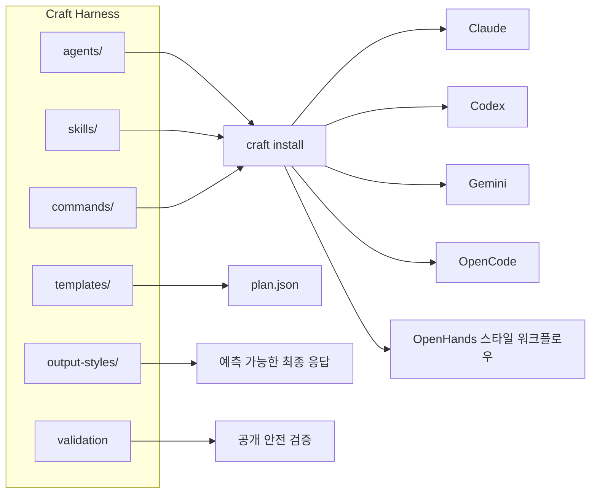
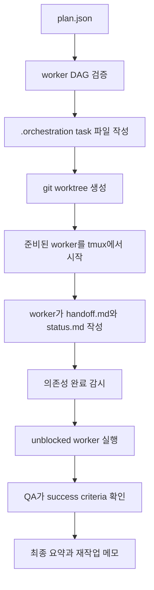

<p align="center">
  
</p>

<h1 align="center">Craft Harness</h1>

<p align="center">
  여러 AI 코딩 에이전트를 함께 쓰는 팀을 위한 이식 가능한 에이전트 팩,
  런타임 어댑터, 오케스트레이션 계약입니다.
</p>

<p align="center">
  <a href="README.md">English</a> ·
  <a href="README.ko.md">한국어</a> ·
  <a href="README.ja.md">日本語</a> ·
  <a href="README.zh.md">中文</a>
</p>

<p align="center">
  <a href="https://github.com/woogi-kang/craft-harness/actions/workflows/ci.yml"></a>
  <a href="https://github.com/woogi-kang/craft-harness/releases"></a>
  <a href="LICENSE"></a>
  <a href="pyproject.toml"></a>
  <a href="https://github.com/woogi-kang/homebrew-tap"></a>
</p>

<p align="center">
  <a href="docs/install.md">Installation</a> ·
  <a href="docs/architecture.md">Architecture</a> ·
  <a href="docs/skill-catalog.md">Skill Catalog</a> ·
  <a href="docs/spec-contract.md">Plan Contract</a>
</p>

Craft Harness는 또 하나의 코딩 에이전트가 아닙니다. Claude, Codex, Gemini,
OpenCode, OpenHands 스타일 워크플로우 주변에 놓이는 하네스 레이어입니다. 재사용
가능한 역할, 스킬, 커맨드, output style, 설치 어댑터, worktree 오케스트레이션,
검증 계약을 한곳에서 관리합니다.

이 레포는 private predecessor에서 오픈소스 공개를 위해 깨끗하게 분리한 staging
repo입니다. 초기 공개 범위는 Core + Dev packs로 제한합니다. 개인 workspace, 로그,
local settings, 검토되지 않은 도메인 팩은 포함하지 않습니다.

## 왜 만들었나요?

AI 코딩은 이제 단발성 프롬프트가 아니라 반복 가능한 엔지니어링 워크플로우가 되고
있습니다. 어려운 부분은 에이전트에게 코드를 쓰게 하는 것만이 아닙니다. 여러 도구를
오가더라도 에이전트 작업이 이식 가능하고, 리뷰 가능하고, 일관되게 유지되는 것이 더
어렵습니다.

팀에서 자주 마주치는 문제는 비슷합니다.

- Claude, Codex, Gemini 등 런타임마다 프롬프트와 에이전트 지침이 따로 흩어짐
- 잘 만든 리뷰/QA 워크플로우가 특정 로컬 환경에 갇힘
- 최종 응답 품질이 에이전트 기본 말투에 과하게 의존함
- 병렬 작업을 하려면 명확한 handoff 계약과 의존성이 필요함
- acceptance criteria, 검증 메모, 실행 산출물의 형식이 표준화되어 있지 않음

Craft Harness는 이런 워크플로우를 공개적으로 검토 가능하고 재사용 가능한 레이어로
정리합니다.

- 재사용 가능한 에이전트와 스킬 팩
- 주요 에이전트 guidance 파일용 런타임 어댑터
- git worktree 기반 DAG 실행
- 성공 기준과 QA 계약
- 사람이 읽기 쉬운 간결한 응답과 도구가 읽을 수 있는 산출물
- 공개용 검증, 설치, secret scan 체크

## 무엇이 다른가요?

| 레이어 | Craft Harness가 제공하는 것 |
| --- | --- |
| 멀티 런타임 어댑터 | Claude, Codex, Gemini, OpenCode 스타일 프로젝트에 설치 가능한 guidance |
| 에이전트/스킬 팩 | 일회성 프롬프트가 아니라 `agents/`, `skills/`, `commands/`로 관리되는 자산 |
| Output styles | `concise-engineer`, `research-brief`, `qa-report`, `executive-summary` 같은 응답 포맷 |
| Worktree 오케스트레이션 | 명시적 의존성과 성공 기준을 가진 plan 기반 worker DAG |
| 검증 계약 | 각 worker가 acceptance criteria, eval type, QA handoff 기대치를 가질 수 있음 |
| 공개 안전 경계 | private workspace, 로그, backup, local settings, 흔한 secret 패턴을 차단하는 validation |

## 어떻게 동작하나요?

Craft Harness는 재사용 가능한 자산을 하나의 portable repo에 두고, 각 runtime에 맞는
guidance를 설치하거나 export합니다.



오케스트레이터는 plan을 격리된 worktree, tmux worker, handoff 파일, QA-ready
completion contract로 변환합니다.



## 이런 사람에게 좋습니다

Craft Harness는 이런 경우에 잘 맞습니다.

- 하나의 코드베이스에서 여러 AI 코딩 에이전트를 함께 쓰는 팀
- 매번 프롬프트를 새로 만들지 않고 재사용 가능한 에이전트 역할을 갖추고 싶은 개발자
- QA, 리뷰, acceptance criteria를 에이전트 작업 흐름에 포함하고 싶은 팀
- git worktree로 병렬 에이전트 작업을 돌리고 더 명확한 조율 방식을 원하는 사용자
- 자체 agent pack, coding harness, 내부 AI work system을 만들고 싶은 빌더
- fork하고, 검토하고, 확장할 수 있는 오픈소스 베이스라인이 필요한 사람

단일 프롬프트, 호스팅된 에이전트 UI, 완전 관리형 클라우드 자동화 플랫폼만 필요한
경우에는 과할 수 있습니다.

## 현재 공개 범위

| Pack | 내용 |
| --- | --- |
| Core | CLI, adapters, orchestration scripts, output styles, validation |
| Dev | FastAPI, Next.js, Flutter, browser test, TDD, build repair, live QA |
| Design QA | `design-harness`, styling, design-system, visual QA guidance |
| Review | code, architecture, security, design, content review agents |

한국생활, 법무, 재무, 마케팅, 기획, 콘텐츠 팩은 초기 공개 범위에 포함하지 않습니다.
이후 license, secret, 품질 검토를 거쳐 optional pack으로 분리할 예정입니다.

## 런타임 지원

| Runtime | 설치 명령 | 설치되는 항목 | 지원 수준 |
| --- | --- | --- | --- |
| Claude | `craft install --target claude --dest ~/.claude` | `agents/`, `skills/`, `commands/` | asset install |
| Codex | `craft install --target codex --dest PROJECT` | `AGENTS.md` | guidance adapter |
| Gemini | `craft install --target gemini --dest PROJECT` | `GEMINI.md` | guidance adapter |
| OpenCode | `craft install --target opencode --dest PROJECT` | `AGENTS.md` | guidance adapter |
| OpenHands | `craft install --target openhands --dest PROJECT` | `AGENTS.md`, `.agents/skills/` | skill registry export |

install 명령은 기본적으로 기존 파일을 덮어쓰지 않습니다. 변경 사항만 보고 싶으면
`--dry-run`을 사용하고, 기존 adapter나 skill directory를 의도적으로 교체할 때만
`--force`를 사용하세요.

## 설치

Prerequisites:

| Tool | 필요한 경우 |
| --- | --- |
| Python 3.11+ | `craft` CLI |
| git | validation, worktree orchestration |
| tmux | `craft orchestrate --execute`, `--watch`, `--status` |
| Claude/Codex/Gemini/OpenCode/OpenHands | 해당 runtime adapter를 사용할 때만 |

### curl

public repository에서 바로 설치할 수 있습니다.

```bash
curl -fsSL https://raw.githubusercontent.com/woogi-kang/craft-harness/main/scripts/install.sh | bash
craft doctor
```

기본 설치 위치는 `~/.local/share/craft-harness`이고, 실행 파일은
`~/.local/bin/craft`로 연결됩니다.

### Homebrew

```bash
brew install woogi-kang/tap/craft-harness
craft doctor
```

이 명령은 [`woogi-kang/homebrew-tap`](https://github.com/woogi-kang/homebrew-tap)의
versioned formula를 사용합니다.

### Source Checkout

로컬 개발용 설치는 아래처럼 진행합니다.

```bash
git clone https://github.com/woogi-kang/craft-harness.git
cd craft-harness
python3 -m pip install -e .
craft doctor
craft validate
craft catalog --format md --output docs/skill-catalog.md
craft orchestrate examples/plan.json --dry-run
```

editable install 없이 로컬 wrapper로 바로 실행할 수도 있습니다.

```bash
./craft doctor
./craft catalog --format json
```

custom prefix, 로컬 installer 테스트, uninstall 명령은 [Installation](docs/install.md)을
참고하세요.

## Quick Start

```bash
craft doctor
craft validate
craft catalog --format md
```

git repo 안에서는 bundled orchestration example을 미리 볼 수 있습니다.

```bash
craft orchestrate examples/plan.json --dry-run
```

그 다음 사용할 runtime adapter 하나를 골라 프로젝트에 guidance를 설치합니다.

```bash
craft install --target codex --dest /path/to/project
craft install --target gemini --dest /path/to/project
craft install --target opencode --dest /path/to/project
craft install --target openhands --dest /path/to/project
```

## 튜토리얼: 처음 5분

### 1. 하네스 상태 확인

clone 후 로컬 health check를 실행합니다.

```bash
craft doctor
```

이 명령은 repo 구조, Python 버전, git 설치 여부, 공개 agent/skill/command/template
디렉터리가 준비되어 있는지 확인합니다.

### 2. 스킬 카탈로그 확인

사람이 읽기 쉬운 Markdown 카탈로그를 생성합니다.

```bash
craft catalog --format md --output /tmp/craft-skill-catalog.md
```

다른 도구가 읽을 JSON 카탈로그도 만들 수 있습니다.

```bash
craft catalog --format json > /tmp/craft-catalog.json
```

카탈로그는 `skills/**/SKILL.md` frontmatter에서 생성됩니다. 따라서 pack author는
별도 registry를 직접 수정하지 않고 스킬을 추가할 수 있습니다.

### 3. 다른 프로젝트에 어댑터 설치

샌드박스 프로젝트에 Codex guidance를 설치합니다.

```bash
mkdir -p /tmp/craft-demo-codex
craft install --target codex --dest /tmp/craft-demo-codex
```

Gemini, OpenCode, OpenHands 스타일 guidance도 같은 방식으로 설치합니다.

```bash
craft install --target gemini --dest /tmp/craft-demo-gemini
craft install --target opencode --dest /tmp/craft-demo-opencode
craft install --target openhands --dest /tmp/craft-demo-openhands --dry-run
```

Claude 자산은 명시적인 sandbox 위치에 설치할 수 있습니다.

```bash
craft install --target claude --dest /tmp/craft-claude-sandbox
```

Claude 설치는 `agents/`, `skills/`, `commands/`를 복사합니다. Codex, Gemini,
OpenCode target은 destination project에 adapter guidance 파일을 설치합니다.
OpenHands는 adapter guidance와 `.agents/skills/`를 함께 설치합니다.

대상 프로젝트 출력 예:

```text
PROJECT/
├── AGENTS.md              # Codex, OpenCode, OpenHands guidance
├── GEMINI.md              # Gemini 선택 시 생성
└── .agents/skills/        # OpenHands skill registry export
```

### 4. 오케스트레이션 dry-run

git repository 안에서 에이전트를 실행하지 않고 두 worker plan을 미리 봅니다.

```bash
craft orchestrate examples/plan.json --dry-run
```

예제 plan은 Backend worker를 먼저 만들고, Backend output에 의존하는 QA worker를
뒤에 배치합니다. dry-run은 실행 전에 tmux session 이름, worker 순서, worktree
경로, coordination directory를 보여줍니다.

## 예제 Plan

```bash
cat > plan.json <<'JSON'
{
  "session": "checkout-hardening",
  "base_ref": "HEAD",
  "workers": [
    {
      "name": "Implementation",
      "task": "Implement checkout validation for missing shipping address.",
      "success_criteria": [
        "The API rejects missing shipping addresses with a 422 response",
        "The UI shows a clear field-level error"
      ],
      "eval_type": "fullstack"
    },
    {
      "name": "QA",
      "task": "Review the implementation against every success criterion.",
      "depends_on": ["Implementation"],
      "success_criteria": [
        "Every criterion has a PASS or FAIL decision",
        "Any failure includes a concrete rework instruction"
      ],
      "eval_type": "review"
    }
  ]
}
JSON

craft orchestrate plan.json --dry-run
```

전체 plan contract는 [Spec and Contract Notes](docs/spec-contract.md)를 참고하세요.

## 자주 쓰는 워크플로우

| 목표 | 명령 |
| --- | --- |
| 로컬 셋업 확인 | `craft doctor` |
| 공개 repo 내용 검증 | `craft validate` |
| Markdown 스킬 카탈로그 생성 | `craft catalog --format md --output docs/skill-catalog.md` |
| JSON 카탈로그 생성 | `craft catalog --format json` |
| 런타임 어댑터 설치 | `craft install --target codex --dest /path/to/project` |
| 오케스트레이션 plan 미리보기 | `craft orchestrate examples/plan.json --dry-run` |
| plan 실행 | `craft orchestrate examples/plan.json --execute` |
| 의존성 handoff 감시 | `craft orchestrate examples/plan.json --watch` |

## 오케스트레이션

Craft Harness는 병렬 worker를 위해 격리된 git worktree와 tmux window를 사용합니다.

```bash
craft orchestrate examples/plan.json --dry-run
craft orchestrate examples/plan.json --execute
craft orchestrate examples/plan.json --watch
```

공개 plan 형식은 다음 필드를 지원합니다.

- `session`
- `base_ref`
- `launcher`
- `workers[].name`
- `workers[].task`
- `workers[].depends_on`
- `workers[].blocked_by`
- `workers[].success_criteria`
- `workers[].eval_type`
- `workers[].allowed_paths`
- `workers[].artifacts`

repo 레이어와 실행 모델은 [Architecture](docs/architecture.md)를 참고하세요.

## Output Styles

Output style은 `output-styles/`에 있으며, 작업 모드별로 간결하고 예측 가능한 최종
응답을 정의합니다.

- `concise-engineer`
- `research-brief`
- `qa-report`
- `executive-summary`

원칙은 사람이 읽기 쉬운 Markdown을 먼저 제공하고, 필요한 경우 도구가 읽을 수 있는
run artifact를 함께 남기는 것입니다.

Claude 설치에서는 기본 adapter가 `output-styles/concise-engineer.md`를 가리킵니다.
다른 runtime에서는 native installer가 추가되기 전까지 필요한
`output-styles/*.md` 내용을 project guidance에 복사해 사용할 수 있습니다.

현재 style pack은 [Output Styles](docs/output-styles.md)에 정리되어 있습니다.

## 프로젝트 구조

```text
agents/          개발, 디자인 QA, 리뷰 역할 정의
skills/          SKILL.md frontmatter를 가진 이식 가능한 작업 워크플로우
commands/        재사용 가능한 command guidance
templates/       팀 오케스트레이션 템플릿
adapters/        Claude, Codex, Gemini, OpenCode, OpenHands용 runtime guidance
output-styles/   최종 응답 포맷 preset
examples/        예제 오케스트레이션 plan
schemas/         공개 JSON schema
scripts/         validation, install, orchestration helper
docs/            architecture, contract, catalog, launch notes
```

## 검증

```bash
make test
python3 scripts/check-markdown-links.py .
python3 -m compileall -q src scripts
```

validation gate는 로컬 셋업, skill frontmatter, 공개 금지 파일 경계,
high-confidence secret 패턴, catalog generation, plan schema validation,
orchestration dry-run, Markdown link, Python compilation을 확인합니다.

CI는 local installer 테스트도 실행합니다. symlink된 `craft` 명령이 설치된 harness
자산을 찾고, 별도 git repository를 대상으로 orchestration dry-run을 수행할 수
있는지 확인합니다.

## Roadmap

가까운 오픈소스 로드맵은 다음에 집중합니다.

- pack metadata와 compatibility tag
- 더 강한 plan schema validation
- replay 가능한 run log와 trajectory summary
- OpenCode, OpenHands export 강화
- MCP와 LSP extension point
- license, secret, 품질 검토를 마친 optional domain pack

공개 로드맵은 [ROADMAP.md](ROADMAP.md)를 참고하세요.

## Contributing

bug fix, 문서, adapter, validation check, output style, 제한된 범위의 Core/Dev pack
개선 기여를 환영합니다.

pull request 전에는 아래 검증을 실행하세요.

```bash
craft validate
python3 scripts/check-markdown-links.py .
python3 scripts/validate-plan.py examples/plan.json
```

큰 변경을 제안하기 전에는 [CONTRIBUTING.md](CONTRIBUTING.md),
[SECURITY.md](SECURITY.md), [SUPPORT.md](SUPPORT.md)를 확인해 주세요.

maintainer는 새 버전 태그나 Homebrew tap 업데이트 전에
[Release Process](docs/release.md)를 따라야 합니다.

## License

Apache-2.0. 기여는 `CONTRIBUTING.md`에 설명된 Developer Certificate of Origin에
따라 받습니다.
