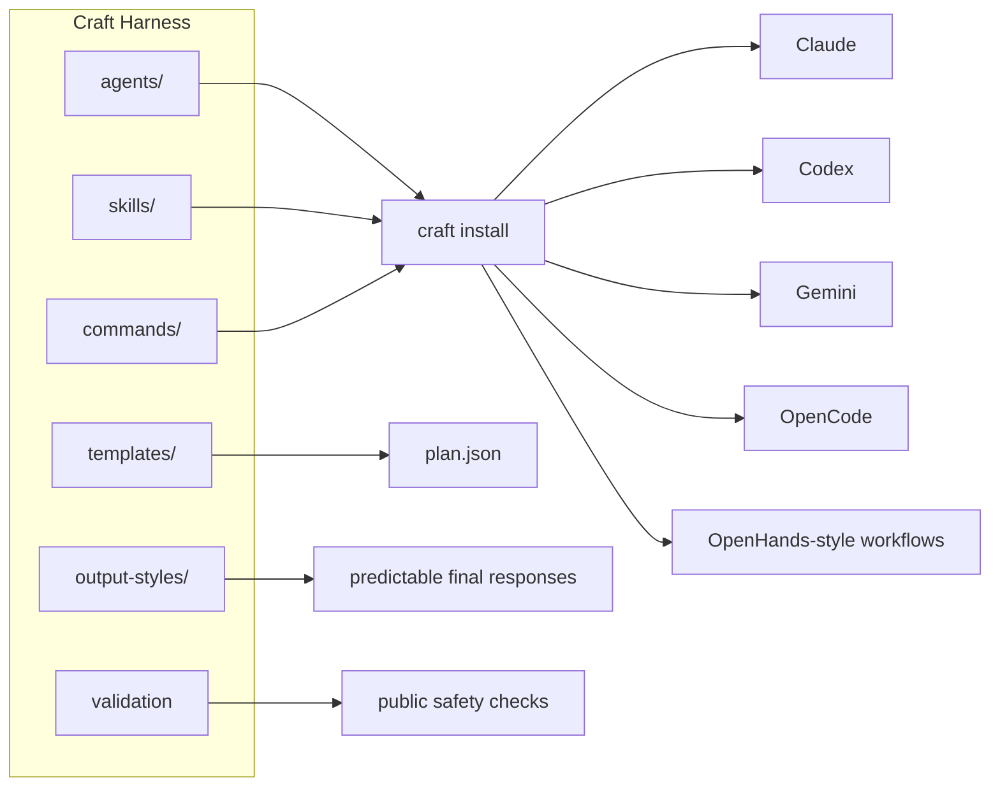
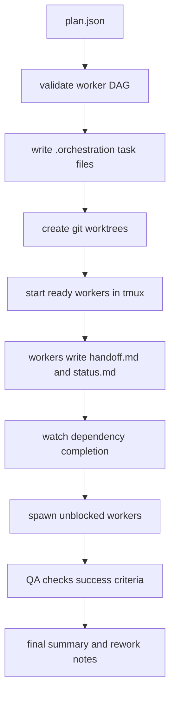

<p align="right">
  <a href="README.md"><kbd>English</kbd></a>
  <a href="README.ko.md"><kbd>한국어</kbd></a>
</p>

# Craft Harness

**Portable agent packs, runtime adapters, and orchestration contracts for teams
that use more than one AI coding agent.**

Craft Harness is not another coding agent. It is the harness layer around your
agents: reusable roles, skills, commands, output styles, install adapters,
worktree orchestration, and validation contracts for Claude, Codex, Gemini,
OpenCode, and OpenHands-style workflows.

This repository is intentionally split from a private predecessor. It starts as a
clean open-source staging repo with only the Core and Dev packs: no private
workspace, no personal logs, no local settings, and no unreviewed domain packs.

## Why This Exists

AI coding has moved from one-off prompts to repeatable engineering workflows.
The hard part is no longer just asking an agent to write code. The hard part is
making agent work portable, reviewable, and consistent across different tools.

Most teams quickly run into the same problems:

- prompts and agent instructions drift between Claude, Codex, Gemini, and other
  runtimes
- good review or QA workflows stay trapped in one local setup
- output quality depends too much on the agent's default tone
- parallel work is hard to coordinate without clear handoff contracts
- run artifacts, acceptance criteria, and verification notes are not standardized

Craft Harness provides a public, inspectable layer for those workflows:

- reusable agent and skill packs
- runtime adapters for common agent guidance files
- worktree-based DAG execution
- success criteria and QA contracts
- concise human output plus machine-readable sidecars
- public validation and install checks

## What Makes It Different

| Layer | What Craft Harness Provides |
| --- | --- |
| Multi-runtime adapters | Installable guidance for Claude, Codex, Gemini, and OpenCode-style projects |
| Agent and skill packs | Portable `agents/`, `skills/`, and `commands/` instead of one-off prompts |
| Output styles | Reusable response formats such as `concise-engineer`, `research-brief`, `qa-report`, and `executive-summary` |
| Worktree orchestration | Plan-driven worker DAGs with explicit dependencies and success criteria |
| Verification contracts | Each worker can carry acceptance criteria, eval type, and QA handoff expectations |
| Public safety boundary | Validation blocks private workspaces, logs, backups, local settings, and common secret patterns |

## How It Works

Craft Harness keeps reusable assets in one portable repo, then installs or
exports the right guidance for each runtime.



The orchestrator turns a plan into isolated worktrees, tmux workers, handoff
files, and QA-ready completion contracts.



## Who Should Use This

Craft Harness is a good fit if you:

- maintain a codebase where multiple AI coding agents are used side by side
- want reusable agent roles instead of rebuilding prompts for every project
- need QA, review, and acceptance criteria to be part of the workflow
- run parallel agent work in git worktrees and want cleaner coordination
- are building your own agent pack, coding harness, or internal AI work system
- want an open-source baseline you can fork, audit, and extend

It is probably not the right fit if you only need a single prompt, a hosted agent
UI, or a fully managed cloud automation platform.

## Current Scope

| Pack | Contents |
| --- | --- |
| Core | CLI, adapters, orchestration scripts, output styles, validation |
| Dev | FastAPI, Next.js, Flutter, browser test, TDD, build repair, live QA |
| Design QA | `design-harness`, styling, design-system, visual QA guidance |
| Review | code, architecture, security, design, content review agents |

Optional Korea, legal, finance, marketing, planning, and content packs are not
included in this initial public scope.

## Runtime Support

| Runtime | Install command | What is installed | Support level |
| --- | --- | --- | --- |
| Claude | `craft install --target claude --dest ~/.claude` | `agents/`, `skills/`, `commands/` | asset install |
| Codex | `craft install --target codex --dest PROJECT` | `AGENTS.md` | guidance adapter |
| Gemini | `craft install --target gemini --dest PROJECT` | `GEMINI.md` | guidance adapter |
| OpenCode | `craft install --target opencode --dest PROJECT` | `AGENTS.md` | guidance adapter |
| OpenHands | `craft install --target openhands --dest PROJECT` | `AGENTS.md`, `.agents/skills/` | skill registry export |

Install commands refuse to replace existing files by default. Use `--dry-run` to
preview changes and `--force` only when you intentionally want to replace an
existing adapter or skill directory.

## Installation

Prerequisites:

| Tool | Required for |
| --- | --- |
| Python 3.11+ | `craft` CLI |
| git | validation and worktree orchestration |
| tmux | `craft orchestrate --execute`, `--watch`, and `--status` |
| Claude/Codex/Gemini/OpenCode/OpenHands | only when using that runtime adapter |

### curl

Install from the public repository:

```bash
curl -fsSL https://raw.githubusercontent.com/woogi-kang/craft-harness/main/scripts/install.sh | bash
craft doctor
```

The installer places the harness in `~/.local/share/craft-harness` and links
`craft` into `~/.local/bin`.

### Homebrew

```bash
brew install woogi-kang/tap/craft-harness
craft doctor
```

This installs the versioned formula from
[`woogi-kang/homebrew-tap`](https://github.com/woogi-kang/homebrew-tap).

### Source Checkout

For local development:

```bash
git clone https://github.com/woogi-kang/craft-harness.git
cd craft-harness
python3 -m pip install -e .
craft doctor
craft validate
craft catalog --format md --output docs/skill-catalog.md
craft orchestrate examples/plan.json --dry-run
```

You can also run the local wrapper without editable install:

```bash
./craft doctor
./craft catalog --format json
```

See [Installation](docs/install.md) for custom prefixes, local installer tests,
and uninstall commands.

## Quick Start

```bash
craft doctor
craft validate
craft catalog --format md
```

From a git-backed project, preview the bundled orchestration example:

```bash
craft orchestrate examples/plan.json --dry-run
```

Then choose one runtime adapter to install into a project:

```bash
craft install --target codex --dest /path/to/project
craft install --target gemini --dest /path/to/project
craft install --target opencode --dest /path/to/project
craft install --target openhands --dest /path/to/project
```

## Tutorial: First 5 Minutes

### 1. Check the Harness

Run a local health check after cloning:

```bash
craft doctor
```

This verifies the expected repo shape, Python version, git availability, and
public agent, skill, command, and template directories.

### 2. Inspect the Skill Catalog

Generate a Markdown catalog for humans:

```bash
craft catalog --format md --output /tmp/craft-skill-catalog.md
```

Generate JSON when another tool should consume the catalog:

```bash
craft catalog --format json > /tmp/craft-catalog.json
```

The catalog is built from `skills/**/SKILL.md` frontmatter, so pack authors can
add skills without updating a hand-written registry.

### 3. Install an Adapter Into a Project

Install Codex guidance into a sandbox project:

```bash
mkdir -p /tmp/craft-demo-codex
craft install --target codex --dest /tmp/craft-demo-codex
```

Install Gemini, OpenCode, or OpenHands-style guidance the same way:

```bash
craft install --target gemini --dest /tmp/craft-demo-gemini
craft install --target opencode --dest /tmp/craft-demo-opencode
craft install --target openhands --dest /tmp/craft-demo-openhands --dry-run
```

Install Claude assets into an explicit sandbox location:

```bash
craft install --target claude --dest /tmp/craft-claude-sandbox
```

Claude installation copies `agents/`, `skills/`, and `commands/`. Codex,
Gemini, and OpenCode targets install adapter guidance files into the destination
project. OpenHands installs adapter guidance plus `.agents/skills/`.

Target project output:

```text
PROJECT/
├── AGENTS.md              # Codex, OpenCode, or OpenHands guidance
├── GEMINI.md              # Gemini guidance when selected
└── .agents/skills/        # OpenHands skill registry export
```

### 4. Dry-run an Orchestration Plan

From a git repository, preview a two-worker plan without starting any agent:

```bash
craft orchestrate examples/plan.json --dry-run
```

The example plan creates a Backend worker first, then a QA worker that depends
on Backend output. Dry-run mode shows the tmux session name, worker order,
worktree paths, and coordination directory before anything executes.

## Example Plan

```bash
cat > plan.json <<'JSON'
{
  "session": "checkout-hardening",
  "base_ref": "HEAD",
  "workers": [
    {
      "name": "Implementation",
      "task": "Implement checkout validation for missing shipping address.",
      "success_criteria": [
        "The API rejects missing shipping addresses with a 422 response",
        "The UI shows a clear field-level error"
      ],
      "eval_type": "fullstack"
    },
    {
      "name": "QA",
      "task": "Review the implementation against every success criterion.",
      "depends_on": ["Implementation"],
      "success_criteria": [
        "Every criterion has a PASS or FAIL decision",
        "Any failure includes a concrete rework instruction"
      ],
      "eval_type": "review"
    }
  ]
}
JSON

craft orchestrate plan.json --dry-run
```

For the full plan contract, see [Spec and Contract Notes](docs/spec-contract.md).

## Common Workflows

| Goal | Command |
| --- | --- |
| Check local setup | `craft doctor` |
| Validate public repo contents | `craft validate` |
| Generate human skill catalog | `craft catalog --format md --output docs/skill-catalog.md` |
| Generate machine-readable catalog | `craft catalog --format json` |
| Install runtime adapter | `craft install --target codex --dest /path/to/project` |
| Preview an orchestration plan | `craft orchestrate examples/plan.json --dry-run` |
| Execute a plan | `craft orchestrate examples/plan.json --execute` |
| Watch dependency handoffs | `craft orchestrate examples/plan.json --watch` |

## Orchestration

Craft Harness uses isolated git worktrees and tmux windows for parallel workers.

```bash
craft orchestrate examples/plan.json --dry-run
craft orchestrate examples/plan.json --execute
craft orchestrate examples/plan.json --watch
```

The public plan format supports:

- `session`
- `base_ref`
- `launcher`
- `workers[].name`
- `workers[].task`
- `workers[].depends_on`
- `workers[].blocked_by`
- `workers[].success_criteria`
- `workers[].eval_type`
- `workers[].allowed_paths`
- `workers[].artifacts`

See [Architecture](docs/architecture.md) for the repo layers and execution
model.

## Output Styles

Output styles live in `output-styles/` and define concise, predictable final
responses for common work modes:

- `concise-engineer`
- `research-brief`
- `qa-report`
- `executive-summary`

The principle is human-readable Markdown first, machine-readable run artifacts
second.

For Claude installs, the default adapter points at
`output-styles/concise-engineer.md`. Other runtimes can copy the relevant
`output-styles/*.md` content into their project guidance until native output
style installers are added.

See [Output Styles](docs/output-styles.md) for the current style pack.

## Project Layout

```text
agents/          Role definitions for development, design QA, and review
skills/          Portable task workflows with SKILL.md frontmatter
commands/        Reusable command guidance
templates/       Team orchestration templates
adapters/        Runtime guidance files for Claude, Codex, Gemini, OpenCode, OpenHands
output-styles/   Final response format presets
examples/        Example orchestration plans
schemas/         Public JSON schemas
scripts/         Validation, install, and orchestration helpers
docs/            Architecture, contracts, catalog, and launch notes
```

## Validation

```bash
make test
python3 scripts/check-markdown-links.py .
python3 -m compileall -q src scripts
```

The validation gate checks local setup, skill frontmatter, public file
exclusions, high-confidence secret patterns, catalog generation, plan schema
validation, orchestration dry-run, Markdown links, and Python compilation.

CI also runs a local installer test to make sure a symlinked `craft` command can
find the installed harness assets and orchestrate against a separate git
repository.

## Roadmap

Near-term open-source work focuses on:

- pack metadata and compatibility tags
- stronger plan schema validation
- replayable run logs and trajectory summaries
- richer OpenCode and OpenHands exports
- MCP and LSP extension points
- optional domain packs after license, secret, and quality review

See [ROADMAP.md](ROADMAP.md) for the public roadmap.

## Contributing

Contributions are welcome for bug fixes, docs, adapters, validation checks,
output styles, and carefully scoped Core or Dev pack improvements.

Before opening a pull request:

```bash
craft validate
python3 scripts/check-markdown-links.py .
python3 scripts/validate-plan.py examples/plan.json
```

Read [CONTRIBUTING.md](CONTRIBUTING.md), [SECURITY.md](SECURITY.md), and
[SUPPORT.md](SUPPORT.md) before proposing larger changes.

Maintainers should use [Release Process](docs/release.md) when cutting a new
version or updating the Homebrew tap.

## License

Apache-2.0. Contributions are accepted under the Developer Certificate of Origin
as described in `CONTRIBUTING.md`.
