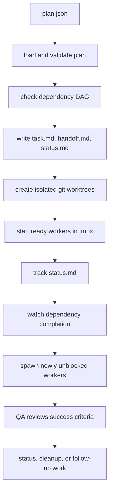

# Architecture

Craft Harness is organized around portable assets and a small CLI.

## Asset Layers

- `agents/`: role definitions and domain behavior.
- `skills/`: task workflows with frontmatter and references.
- `commands/`: reusable command source.
- `templates/`: multi-agent team templates.
- `adapters/`: runtime-specific guidance files.
- `output-styles/`: final response templates.

## Execution Layers

- CLI: `craft doctor`, `catalog`, `validate`, `install`, `orchestrate`.
- Orchestrator: git worktrees plus tmux windows.
- Contracts: success criteria and eval type in `plan.json`.
- QA: live QA agent guidance and eval presets.

## Orchestration Lifecycle

The installed harness can live outside the target project. `craft orchestrate`
uses bundled examples from the harness when needed, but runs the worker DAG
against the current git repository.

## Public Boundary

Core and Dev packs are public in this repo. Optional domain packs should live in
separate repositories or package releases until their licenses, secrets, and
quality gates are reviewed.
